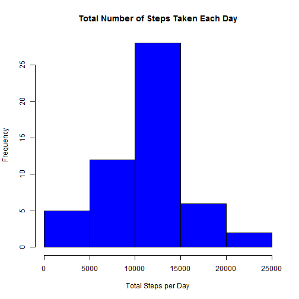
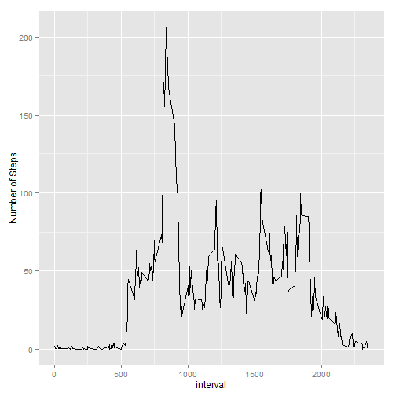
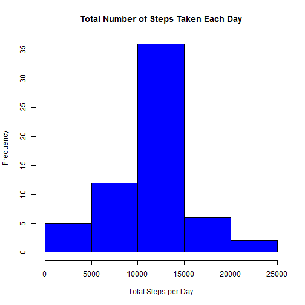
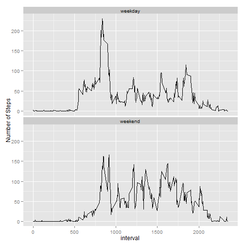

##Introduction

It is now possible to collect a large amount of data about personal movement using activity monitoring devices such as a Fitbit, Nike Fuelband, or Jawbone Up. These type of devices are part of the "quantified self" movement - a group of enthusiasts who take measurements about themselves regularly to improve their health, to find patterns in their behavior, or because they are tech geeks. But these data remain under-utilized both because the raw data are hard to obtain and there is a lack of statistical methods and software for processing and interpreting the data.

This assignment makes use of data from a personal activity monitoring device. This device collects data at 5 minute intervals through out the day. The data consists of two months of data from an anonymous individual collected during the months of October and November, 2012 and include the number of steps taken in 5 minute intervals each day.

##Data

The data for this assignment can be downloaded from the course web site:

* Dataset: [Activity monitoring data](https://d396qusza40orc.cloudfront.net/repdata%2Fdata%2Factivity.zip) [52K]
The variables included in this dataset are:

* __steps__: Number of steps taking in a 5-minute interval (missing values are coded as NA)

* __date__: The date on which the measurement was taken in YYYY-MM-DD format

* __interval__: Identifier for the 5-minute interval in which measurement was taken

The dataset is stored in a comma-separated-value (CSV) file and there are a total of 17,568 observations in this dataset.  


###Loading and preprocessing the data


```r
library(ggplot2)
library(sqldf)

# load the data
activity <- read.csv("activity.csv")
```


###What is mean total number of steps taken per day?
Ignore the missing values in the dataset.

1. Histogram of the total number of steps taken each day

```r
steps_per_day <- aggregate(steps ~ date, data = activity, sum)
hist(steps_per_day$steps, main = "Total Number of Steps Taken Each Day", xlab = "Total Steps per Day", col = "blue")
```

 

2. The mean and median total number of steps taken per day

```r
summary(steps_per_day$steps)[c("Mean","Median")]
```

```
##   Mean Median 
##  10800  10800
```


###What is the average daily activity pattern?

1. A time series plot of the 5-minute interval (x-axis) and the average number of steps taken, averaged across all days (y-axis)


```r
avg_steps <- aggregate(steps ~ interval, data = activity, mean)
ggplot(data=avg_steps, aes(x=interval, y=steps)) + geom_line() + ylab("Number of Steps")
```

 

2. 5-minute interval, on average across all the days with the maximum number of steps?

```r
avg_steps[which.max(avg_steps$steps),]
```

```
##     interval steps
## 104      835 206.2
```


###Imputing missing values

There are a number of days/intervals where there are missing values (coded as NA). The presence of missing days may introduce bias into some calculations or summaries of the data.

1. The total number of missing values in the dataset (i.e. the total number of rows with NAs)

```r
colSums(is.na(activity))
```

```
##    steps     date interval 
##     2304        0        0
```

2. Fill in all of the missing values in the dataset with the mean for that 5-minute interval.

```r
# Data frames referenced in the SQL statement(s) passed to sqldf are automatically imported to SQLite, however sqldf does not automatically export anything for safety reasons. Thus when you update a table using sqldf it must be explicitly returned.

activity_clean <- sqldf(c("update activity set steps = (select round(steps) from avg_steps b where b.interval = activity.interval) where steps is null", "select * from main.activity"))
colSums(is.na(activity_clean))
```

```
##    steps     date interval 
##        0        0        0
```

3. A histogram of the total number of steps taken each day for the dataset with no missing values. 

```r
steps_per_day1 <- aggregate(steps ~ date, data = activity_clean, sum)
hist(steps_per_day1$steps, main = "Total Number of Steps Taken Each Day", xlab = "Total Steps per Day", col = "blue")
```

 

4. The mean and median total number of steps taken per day for the dataset with no missing values

```r
summary(steps_per_day1$steps)[c("Mean","Median")]
```

```
##   Mean Median 
##  10800  10800
```

It appears that imputing missing data doesn't make much impact on the mean and median total number of steps taken per day.  


###Are there differences in activity patterns between weekdays and weekends?

1. Add a weekday factor variable with two levels - "weekday" and "weekend" indicating whether a given date is a weekday or weekend day.

```r
activity_clean$weekday <- ifelse(weekdays(as.Date(activity_clean$date)) %in% c("Saturday","Sunday"),"weekend", "weekday")
```
2. A panel time series plot of the 5-minute interval (x-axis) and the average number of steps taken, averaged across all weekday days or weekend days (y-axis). 

```r
avg_steps_weekday <- aggregate(steps ~ interval, data = activity_clean[activity_clean$weekday == "weekday",], mean)
avg_steps_weekend <- aggregate(steps ~ interval, data = activity_clean[activity_clean$weekday == "weekend",], mean)
avg_steps_weekday$weekday <- "weekday"
avg_steps_weekend$weekday <- "weekend"
avg_steps_weekday <- rbind(avg_steps_weekday,avg_steps_weekend)
ggplot(data=avg_steps_weekday, aes(x=interval, y=steps)) + geom_line() + ylab("Number of Steps") + facet_wrap(~weekday, nrow=2)
```

 
